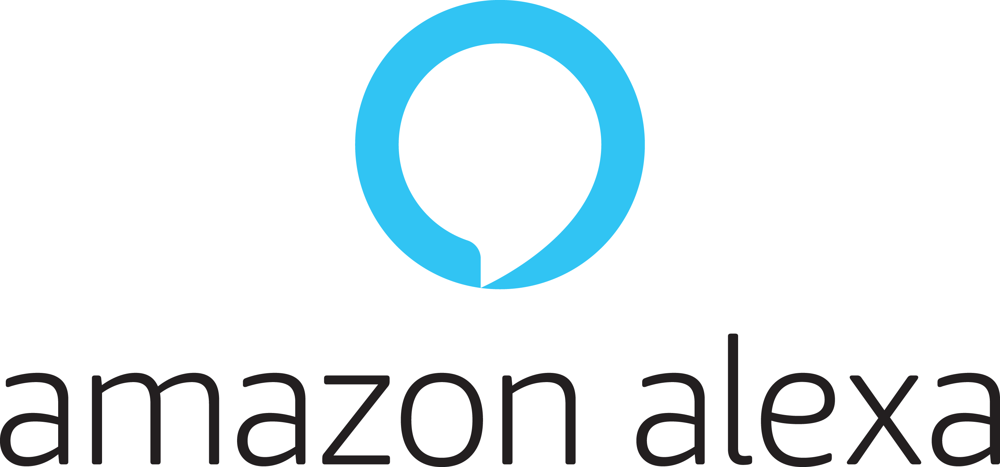

# 2020 Goals

## What I've Been Up To

Before I jump into the meat of this post, I wanted to explain why I haven't written a blog post in quite some time, since October 2018! Two significant things happened not long after that post that have consumed a great deal of my time. Foremost, my second child was born. This was accompanied by the usual months of inadequate sleep and adjustment to life with two children under age 2-3. I also picked up running and started consistently exercising daily for the first time in my life.

While these things made it hard to find time for blogging, I wouldn't give up these experiences for anything. Having adjusted to this new normal, I am excited to start blogging more in 2020.

## The 10 Major Life Areas

Last year, I read [High Performance Habits](https://www.amazon.com/High-Performance-Habits-Extraordinary-People/dp/9386832356/ref=tmm_pap_swatch_0?_encoding=UTF8&qid=1578688558&sr=1-3) by Brendon Burchard. This impactful book taught me, among other things, how high performers set and achieve goals. One practice that the author recommends is reviewing these 10 major life areas[^1] each week:

- Health
- Mission
- Family
- Learning
- Finances
- Friends
- Spirit
- Mental/emotional energy
- Love/heart
- Experiences

Living a balanced life means devoting attention to _all_ of these areas. I've found that it's fulfilling to spend time on an area that has been neglected. For example, I recently spent some time on my finances, reviewing my progress in 2019, investing in my children's college education accounts, and learning about real estate investment options. Having neglected this area of my life for over a month, I found the process rewarding and satisfying.

Some activities or pursuits lead to progress in multiple life areas. This is one of the reasons running has become an important part of my life: it allows me to invest time in health, friends (running group), family (example to my children of lifelong fitness), learning (physiology, training techniques), mental/emotional energy (natural product of exercise), and experiences (trailing running in Utah's mountains, participating in races). Running complements the areas of life that I focus on as a Software Engineer, such as mission, learning, and finances.

In setting goals, I think it's helpful to consider the areas of life each goal will influence; otherwise, we may find that our goals set us up for imbalance.

## Technical Goals

Read 15 books

- [Monolith to Microservices: Evolutionary Patterns to Transform Your Monolith](https://www.amazon.com/Monolith-Microservices-Evolutionary-Patterns-Transform-dp-1492047848/dp/1492047848/ref=mt_paperback?_encoding=UTF8&me=&qid=1578693136)
- [Database Internals: A Deep Dive into How Distributed Data Systems Work](https://www.amazon.com/Database-Internals-Deep-Distributed-Systems/dp/1492040347/ref=sr_1_1?keywords=database+internals&qid=1578693163&s=books&sr=1-1)
- [How Linux Works: What Every Superuser Should Know](https://www.amazon.com/How-Linux-Works-2nd-Superuser/dp/1593275676/ref=sr_1_1?keywords=how+linux+works&qid=1578693182&s=books&sr=1-1)
- [Site Reliability Engineering: How Google Runs Production Systems](https://www.amazon.com/Site-Reliability-Engineering-Production-Systems/dp/149192912X/ref=sr_1_1?keywords=Site+Reliability+Engineering%3A+How+Google+Runs+Production+Systems&qid=1578693196&s=books&sr=1-1)
- [Writing an Interpreter in Go](https://www.amazon.com/Writing-Interpreter-Go-Thorsten-Ball/dp/3982016118/ref=sr_1_1?crid=1IFOMEDT1QZB9&keywords=writing+an+interpreter+in+go&qid=1578693215&s=books&sprefix=writing+an+int%2Cstripbooks%2C194&sr=1-1)
- [Writing a Compiler in Go](https://www.amazon.com/Writing-Compiler-Go-Thorsten-Ball/dp/398201610X/ref=sr_1_1?keywords=writing+a+compiler+in+go&qid=1578693235&s=books&sr=1-1)

Write a blog post each month!

## Non-Technical Goals

This is a software-focused blog, so I'll keep this section short. Here are a handful of non-technical goals I have committed to for 2020:

- Run 1000 miles and bike (or cycle indoors) 1000 miles
    + Running complements software engineering very well. Because we spend so much of our time sitting indoors, I think it's imperative that our hobbies encourage us to spend time on our feet
    + 1000 running miles will push me to continue running 5-6 times per week; 1000 cycling miles will ensure I'm cross-training effectively to avoid common running overuse injuries
- Run the [Utah Valley Marathon](https://www.utahvalleymarathon.com/)
    + Building on the two half marathons I ran in 2019, I signed up for my first full marathon this year
- Improve my routine: wake up at an average time of 6:30 a.m., measured weekly
    + I'm a night owl by habit. In 2019, I made great progress towards a better routine. In 2020, I'm going to try out being a morning person
- Build financial investment portfolio and create a passive income stream

[^1]: https://www.highperformanceplanner.com/

---

# Notes (supplementary to blog post)

