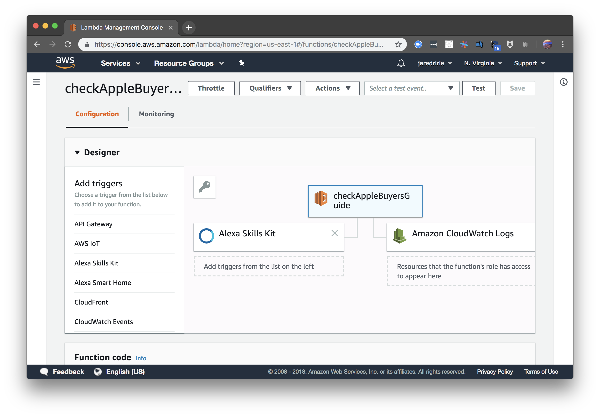
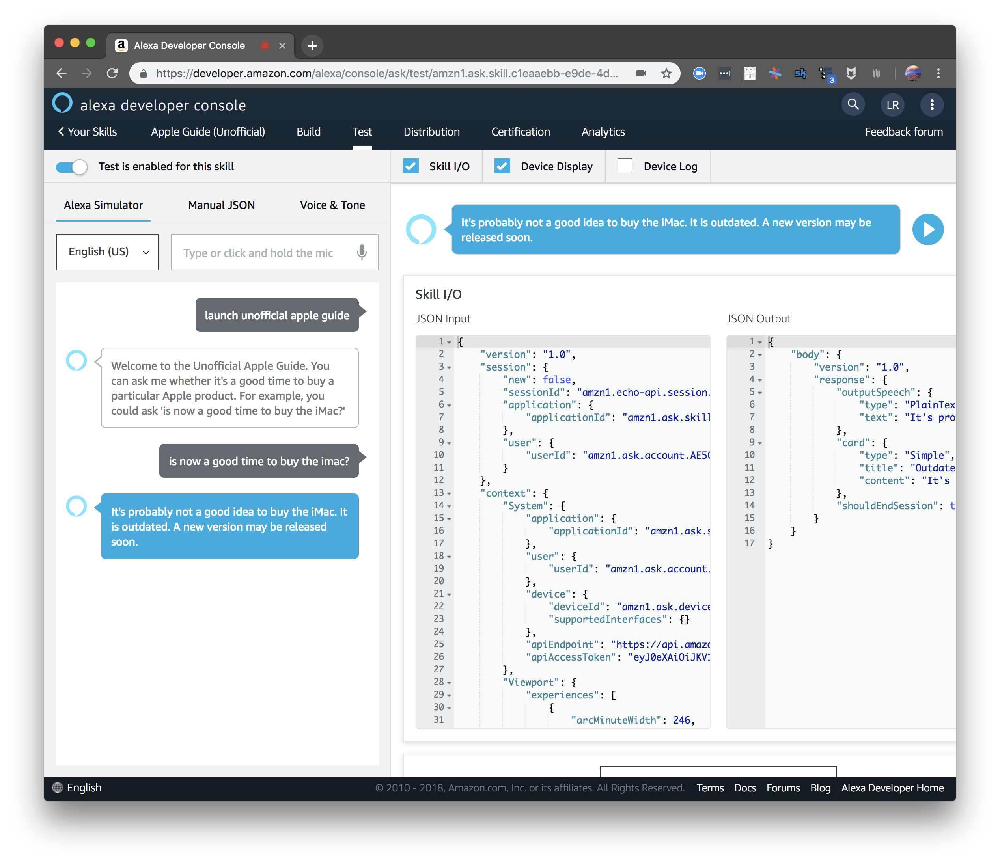

# Implementing an Amazon Alexa Skill with an AWS Lambda Function in Go

Amazon is currently [running a promotion](https://build.amazonalexadev.com/echodot.html) in which developers who publish a new skill to the Alexa Skills Store receive the new Echo Dot. While I do not own any Amazon devices, I decided to participate to get something for free, learn more about developing voice-based applications, and write my first AWS Lambda function in Go.

## Amazon Alexa Skill

(Description of skill I wrote)

(Overview of configuring the skill, including intents)

## AWS Lambda Function

(Basics of Lambda functions and the serverless movement)

(Lambda configuration, implementation in Go)

(Alexa request/response)

## Demonstration

---

# Notes (supplementary to blog post)

https://medium.com/crowdbotics/how-to-build-a-custom-amazon-alexa-skill-step-by-step-my-favorite-chess-player-dcc0edae53fb

* Create a simple Amazon Alexa Skill step-by-step

https://medium.com/@amalec/alexa-skills-with-go-54db0c21e758

* Automate deployment of Go-based AWS Lambdas
* Create and return Alexa Skill Responses
* Handle a variety of Alexa Skill Request attributes (Locale and Attributes)

https://docs.aws.amazon.com/lambda/latest/dg/go-programming-model-handler-types.html

> A Lambda function written in Go is authored as a Go executable. In your Lambda function code, you need to include the github.com/aws/aws-lambda-go/lambda package, which implements the Lambda programming model for Go. In addition, you need to implement handler function code and a main() function.
