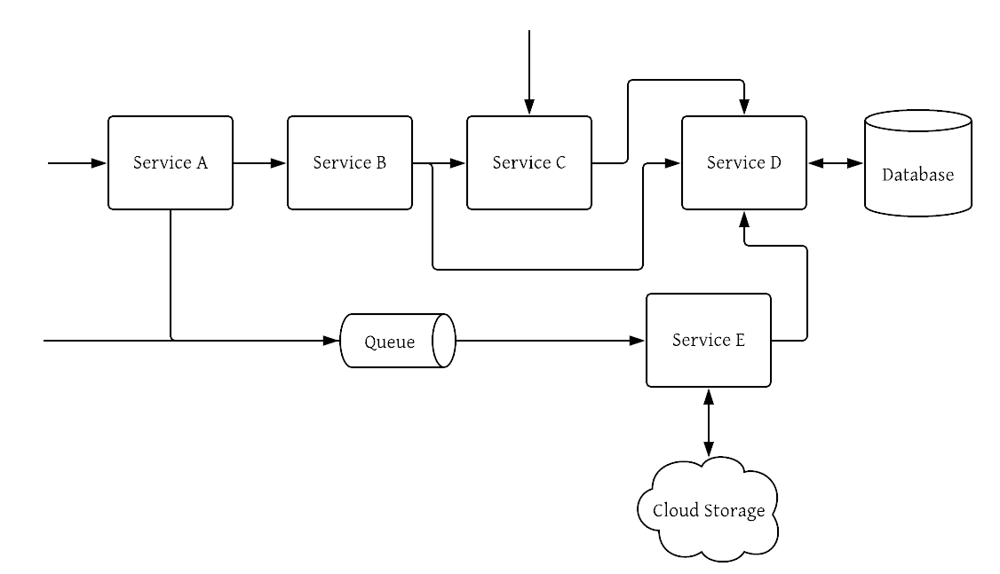
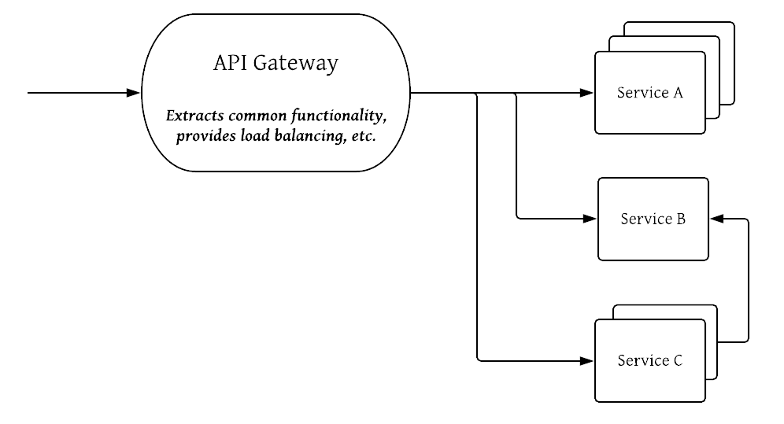

# Microservices: Are We Making a Huge Mistake?

There is a clear trend in the software industry moving away from large, monolithic systems to fine-grained services known as "microservices." While compelling, microservices introduce their own set of challenges and fallacies. This post considers the benefits and drawbacks of a microservices architecture (MSA) and contemplates the question: are we making a huge mistake in adopting this kind of architecture?

## Relationship to "distributed systems"

First, let's clear up some terminology that you may find confusing. A distributed system is a general term which refers to a network of independent computers that form a coherent system. A microservices architecture, on the other hand, is a software development technique for building a software system that _runs on a distributed system_. This kind of architecture encourages small services with lightweight, easy-to-use communication protocols like HTTP/S and RPC.

Building a microservices architecture implies utilizing a distributed system[^1]. This is _not_ an implication to be taken lightly. The foundation of a distributed system has several key fallacies that must be understood in order to build a reliable system!

### Fallacies

L. Peter Deutsch and others at Sun Microservices stated eight false assumptions that new programmers often have regarding distributed systems:

> 1. The network is reliable.
> 2. Latency is zero.
> 3. Bandwidth is infinite.
> 4. The network is secure.
> 5. Topology doesn't change.
> 6. There is one administrator.
> 7. Transport cost is zero.
> 8. The network is homogeneous.[^2]

#### Never assume the network is reliable

When writing code that calls an external service, remember to handle failure scenarios. What happens if your request never makes it to the other service? Will you retry, propagate the failure upwards, log an error, or do nothing? If you choose to retry, at what rate will you retry and for how long? What if your request makes it to the external service and is processed but the response never makes it back to you?

When a system is a traditional monolith, the external service is just another part of the monolith so you’re making a function call, not a network call; if you’re able to make the request, the other component is able to respond. Failure modes are more limited.

#### Network latency is not zero

> Inter-service calls over a network have a higher cost in terms of network latency and message processing time than in-process calls within a monolithic service process.[^3]

Although it takes a measurable amount of time to make a function call, it’s so minimal that for most purposes it can be considered zero. A network call, on the other hand, will take a nontrivial amount of time (maybe 2 ms).

When moving to microservices, it’s important to be mindful when crossing service boundaries. Perhaps your algorithm used to make a few thousand function calls in a monolith. For MSA, the system was split into services such that your function calls become network calls. This does not impact the Big-O runtime of the algorithm but it does change the constant! Could the result of the call be cached? Could the number of calls be reduced?

#### Systems need to handle topology changes gracefully

> Network topology is the arrangement of the elements (links, nodes, etc.) of a communication network.[^4]

A given microservice could have the topology of a cluster of identical nodes. The service is running ("alive", "healthy") when at least one of these nodes is running. If a caller is too strongly connected to the IP address of a particular node in the service, it will be extremely susceptible to a topology change that removes that node from the cluster.

Instead, a tool like [Consul](https://www.consul.io/) can provide DNS service discovery that abstracts the underlying IP addresses of a cluster and allows the service to be discovered via a host-agnostic address like `{service name}.service.consul`. Making requests to a service through this address allows the underlying topology to change without impacting the callers.

### Change of mindset

Working with distributed systems requires a change of mindset. Most of us learned how to program by writing simple command-line applications. Perhaps your first program was the iconic script that printed the words “Hello, world” to the console. Then you progressed to programs that could read in a file, make some changes, and spit out another file. With time, you developed a mental model of how code executes with the simplified assumptions that can be made in a **single computer environment**.

Once a system of computers must solve a problem _in a coordinated manner_, the assumptions we previously could make turn into misconceptions. Communicating with another computer is fundamentally different; we must retrain our mental models to account for this. Some developers do not work within a distributed system until after graduation from college, which means that they're simultaneously adapting to full-time work *and* grappling with the need for a new mental model to understand distributed computing.

## Challenges of a microservices architecture

Here are the primary challenges related to microservices which I have experienced in practice.

### Complexity and cognitive load

The first few microservices which are built will likely require modernizations to the infrastructure to handle problems like service discovery and independent deployability. These improvements, though difficult, push the architecture in the right direction. Often, the first services which are implemented are carefully deliberated and their need is clear. An example of this from my company was a well-placed reverse proxy cache for a monolithic service. It was a clear and impressive win for our system's scalability.

As more microservices are added, however, **the entanglement begins**, raising the cognitive load required to understand the details of how the system really works. The flow of requests through the system is challenging and convoluted.

The need for orchestration, service-to-service software load balancing, and improved fault tolerance becomes evident. The service mesh pattern is one response to the growing complexity of operating microservices at scale. This pattern places a layer of abstraction between a service and the network that presents a more idealized view. For example, instead of all applications handling their own retry logic, the service mesh layer can implement retries with exponential backoff[^5] by default.

### Nanoservices

> Too-fine-grained microservices have been criticized as an anti-pattern, dubbed a nanoservice by Arnon Rotem-Gal-Oz.[^3]

How small is too small? How big is too big? It's hard to get the size of a microservice right. Sometimes in the excitement of breaking up a system, developers go too far and end up building a mess of nanoservices which suffer from a massive amount of overhead.

### Service boundaries and coordinating efforts

> Dividing the backend into 8 separate services followed by a decision to assign services to people enforced ownership of specific services by developers. This led to developers complaining of their service being blocked by tasks on other services and refusing to help out by working with these blocking tasks. The separation also lead to developers losing sight of the overarching system goals, instead only focusing on the service they were working on.[^6]

It's true that the codebases of microservices are easier to fully understand. It's possible for a single engineer to keep all the details in his or her head, leading to safer changes. That said, when service boundaries cross teams, it's easy to make mistakes.

Deployments sometimes must be coordinated. Imagine that service A owned by one team wants to expose a new API that will be used by another team's service B. The fact that service A's deployment had to be rolled back is not communicated to the other team and they proceed with their release, causing all requests to fail which rely on the new APIs. Putting a strong emphasis on backwards compatibility can help these situations. In a monolithic architecture, the deployment was all or nothing, so either the new APIs were released _and_ used, or neither, removing the need for coordinated deployments.

### Duplicated common functionality

Each microservices requires much of the same functionality, which requires all developers to have at least some understanding of things like logging, emitting metrics, creating dashboards, and communicating with other services. While some microservices will nail these aspects, others will have problems, and still others will be missing them entirely. In a monolith, the logging infrastructure only has to be set up once and all components can take advantage of it. This also means that there is a great deal of duplication among microservices, though this can be mitigated in part through shared libraries and gateway layers which provide common functionality.

## Benefits of microservices

This blog post has admittedly had a cautionary tone. I covered the fallacies of distributed systems and many of the challenges of an MSA. So what are the benefits of microservices that have motivated its strong adoption?

### Conway's Law

A monolith can make sense for a company with a small engineering team. Once the number of developers increases, however, the monolith becomes unwieldy, difficult (or impossible) to fully understand, and diffused in ownership. Conway’s Law[^7] simply states that a company’s architecture will mimic the way teams are structured. So as new engineers are hired and teams split or are moved to another office, the architecture naturally evolves as well. Sometimes the monolith refutes this natural evolution and fights against Conway’s Law, leading to an engineering culture that despises the monolith.

Microservices tend to more easily conform to the organization of an engineering team. Give some to one team, a few others to another team, and so on (hopefully these decisions around ownership are taken more seriously than this sentence implied). How do you split up ownership of a monolith? You can’t really, which is why it will erode without invested engineers.

### Independent scalability and deployability

Once a large, monolithic system has been broken into services, it becomes clear which ones require more capacity and which demand very little. The services can then be scaled appropriately. It's also possible at this point to more easily identify bottlenecks and opportunities for optimization.

Deployment becomes decentralized and individual teams must begin to take ownership of their entire deploy pipeline as it's no longer feasible to ask a single team to handle all deployments. I view the possibility to eliminate the "throw code over the wall" mentality as a major step forward for any engineering team: developers tend to write better code when they own it from end to end, never expecting someone else to test their code or find their memory leaks.

### Potential for loose coupling

While it doesn’t come for free, an MSA encourages loose coupling between services. It only takes a few coordinated deployments to stay motivated in this regard! One point of strong coupling common in a monolithic system is shared databases. Adopting microservices is a natural time to avoid perpetuating this pattern and therefore decrease coupling. Queues and other asynchronous workflows can also help tremendously.

## Conclusion: Are We Making a Huge Mistake?

In conclusion, I do not believe that we as an industry are making a huge mistake in adopting microservices. Microservices clearly solve critical software development problems, yet also  present their own challenges and are not a silver bullet by any means. Best practices like service meshes and gateways help mitigate the weaker points of microservices, leading to a much improved architecture overall.

## Further Reading

* [10 books for new software engineers](http://backendology.com/2018/07/30/top-software-books/)
    - Designing Data-Intensive Applications
    - Building Microservices

[^1]: https://www.infoq.com/news/2016/09/microservices-distributed-system
[^2]: https://en.wikipedia.org/wiki/Fallacies_of_distributed_computing
[^3]: https://en.wikipedia.org/wiki/Microservices
[^4]: https://en.wikipedia.org/wiki/Network_topology
[^5]: https://en.wikipedia.org/wiki/Exponential_backoff
[^6]: https://www.infoq.com/news/2014/08/failing-microservices
[^7]: https://en.wikipedia.org/wiki/Conway%27s_law

---

# Notes (supplementary to blog post)

## Service Mesh

> Microservices architectures have given rise to many approaches for making them work well at varying degrees of scale. One widely discussed pattern for large-scale microservices development and delivery is the service mesh pattern.[39]
>
> In a service mesh, each service instance is paired with an instance of a reverse proxy server, called a service proxy, sidecar proxy, or sidecar. The service instance and sidecar proxy share a container, and the containers are managed by a container orchestration tool such as Kubernetes.[40]
>
> The service proxies are responsible for communication with other service instances and can support capabilities such as service (instance) discovery, load balancing, authentication and authorization, secure communications, and others.
>
> In a service mesh, the service instances and their sidecar proxy are said to make up the data plane, which includes not only data management but also request processing and response. The service mesh also includes a control plane for managing the interaction between services, mediated by their sidecar proxies. The most widely discussed service mesh architecture today is Istio, a joint project among Google, IBM, and Lyft.

## Books

*Building Microservices*: helped me make sense of the wonderful and horrific world of microservices

* Service discovery and DNS
* Monitoring
* Continuous integration
* Splitting monolithic systems
* Building resilient systems with partial degradation of functionality
* Asynchronous event-based collaboration

*Designing Data-Intensive Applications*: Rigorous explanations of concepts within distributed and database systems that will give you depth in these areas. This book could be explained a combination of Building Microservices and NoSQL Distilled, supplemented with a whole lot more goodness.

## Distributed System

Many backend systems are an entanglement of services which together can be considered a distributed system. Rather than being monolithic in nature, these systems benefit from things like **independent deployability**, **focused development**, and **loose coupling** yet suffer from the complexities of **partial failure**, **lack of concurrency guarantees**, and **network boundaries**.

This list of tradeoffs is clearly incomplete. Each complexity deserves its own blog post! Once network boundaries exist between components of a system, for example, problems such as discoverability must be dealt with. No longer can I make an easy function call; rather, I must build in some way for one service to find another service and then make a network call. This call could fail (should I retry?) or time out (how long should I wait?). Once I've figured out how to handle these failure scenarios, does *every* service I write need to duplicate this logic or can I abstract it away through a form of middleware?

Topics like caching, consistency, reverse proxying, API gateways, and service meshes are fair game.
